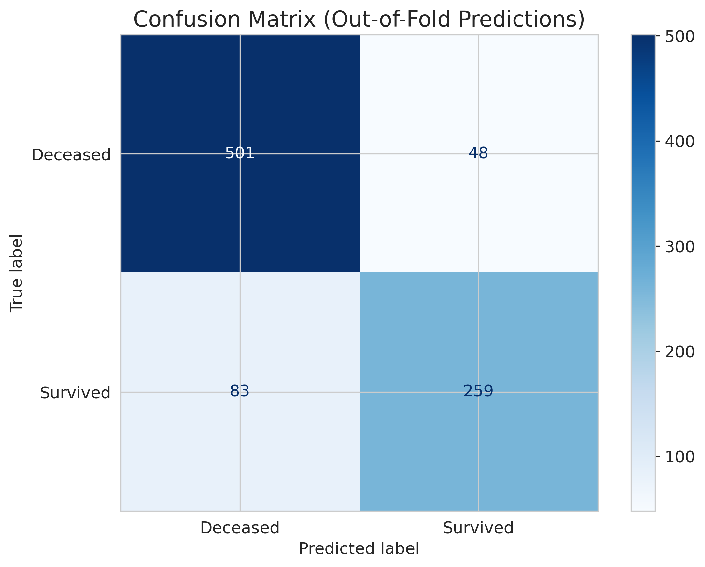
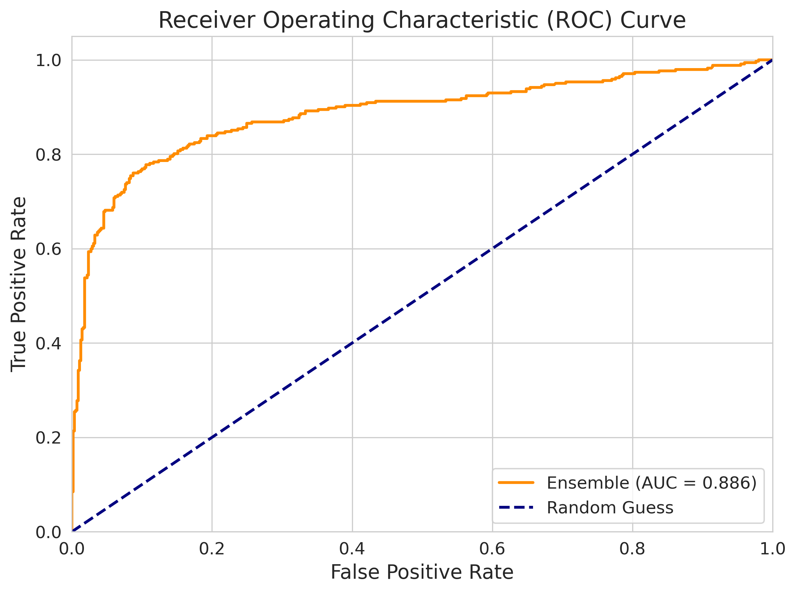
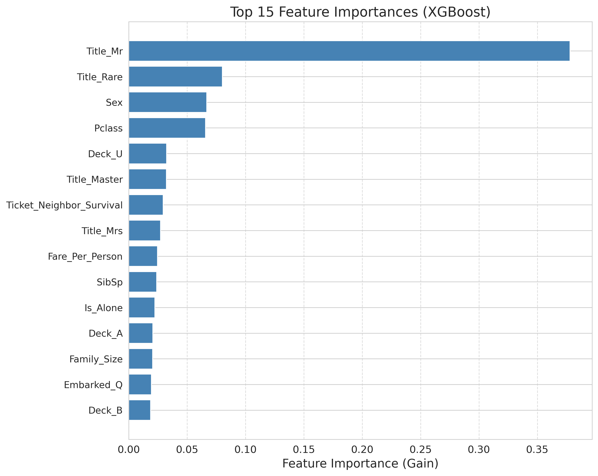
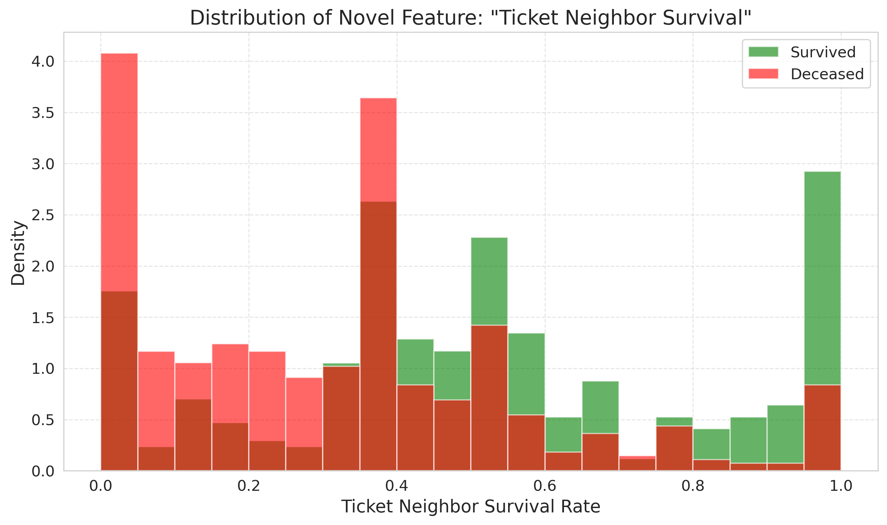
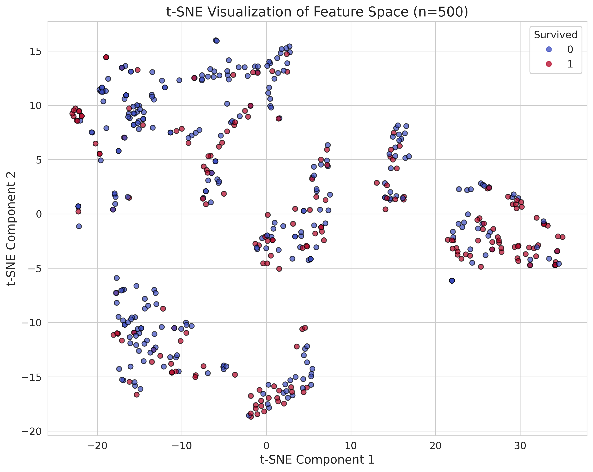

# 🚢 Titanic Survival Prediction: Ticket Neighbor Survival Approach

[](https://www.python.org/)
[](https://xgboost.readthedocs.io/)
[](https://scikit-learn.org/)
[](https://www.kaggle.com/)

## 📖 Overview
This project presents a novel feature engineering approach to the classic [Kaggle Titanic competition](https://www.kaggle.com/competitions/titanic). Instead of relying solely on standard features (age, sex, class), I hypothesized that passengers with nearby ticket numbers were seated in similar areas of the ship, meaning their collective survival rate acts as a proxy for cabin-level safety conditions. 

To test this, I engineered a "Ticket Neighbor Survival" feature using Out-of-Fold (OOF) cross-validation to prevent data leakage. Combined with an ensemble of XGBoost and Random Forest models, this approach achieved:

- **Kaggle Public Leaderboard Score:** `0.77990` (Top ~25%)
- **Cross-Validation Accuracy:** `0.8530` (±0.0128)
- **Improvement over Gender Baseline:** `+1.43%`

## 💡 The Core Hypothesis
> *"If two passengers have ticket numbers within ±50 of each other, they likely boarded together or were assigned adjacent cabins. Therefore, the average survival rate of these 'ticket neighbors' reflects how dangerous or safe that specific area of the ship was during the sinking."*

## 🧠 Feature Engineering Highlights
### Novel Feature: `Ticket_Neighbor_Survival`
- Extracted the numeric portion from `Ticket` strings using regex (e.g., `"A/5 21171"` → `521171`).
- Used 5-Fold Stratified K-Fold to compute this feature on the training set:
  - For each passenger, find neighbors in the *fold training set* with `|Ticket_Num - Neighbor_Ticket_Num| <= 30`.
  - Assign the mean `Survived` rate of those neighbors.
  - Fallback to overall survival rate (0.384) if no neighbors exist.
- Applied the same logic to the test set using the entire training set.

### Additional Features
| Feature | Description |
| :--- | :--- |
| `Title` | Extracted from `Name` (Mr, Mrs, Miss, Master, Rare) |
| `Family_Size` | `SibSp + Parch + 1` |
| `Is_Child` | `Age < 18` |
| `Is_Alone` | `Family_Size == 1` |
| `Fare_Per_Person` | `Fare / Family_Size` |
| `Deck` | First letter of `Cabin` ('U' for unknown) |

## 📊 Model & Performance
### Ensemble Strategy
- **Model 1:** XGBoost (`max_depth=4`, `reg_alpha=1.0`, `reg_lambda=1.0`, `n_estimators=200`)
- **Model 2:** Random Forest (`max_depth=6`, `min_samples_split=5`, `n_estimators=200`)
- **Final Prediction:** Average of predicted probabilities, threshold at 0.5.

### Results
#### Confusion Matrix (Out-of-Fold)


#### ROC Curve


#### Feature Importance (XGBoost)


> **Note:** The novel `Ticket_Neighbor_Survival` feature consistently ranks among the Top most important features, validating the hypothesis.

#### Novel Feature Distribution


#### t-SNE Visualization


### Classification Report
| Class | Precision | Recall | F1-Score | Support |
| :--- | :--- | :--- | :--- | :--- |
| Deceased (0) | 0.87 | 0.88 | 0.88 | 549 |
| Survived (1) | 0.81 | 0.80 | 0.81 | 342 |
| **Accuracy** | **0.853** | | | 891 |
| **Macro Avg** | 0.84 | 0.84 | 0.84 | 891 |
| **Weighted Avg** | 0.85 | 0.85 | 0.85 | 891 |

## 🛠️ Technologies Used
- **Language:** Python 3.8+
- **Data Manipulation:** Pandas, NumPy
- **Visualization:** Matplotlib, Seaborn
- **Machine Learning:** Scikit-Learn, XGBoost
- **Environment:** Kaggle Notebooks

## 📁 Project Structure
titanic-ticket-neighbor/
├── notebook/
│ └── titanic_ticket_neighbor.ipynb # Full Kaggle notebook
├── images/
│ ├── confusion_matrix.png
│ ├── roc_curve.png
│ ├── feature_importance.png
│ ├── novel_feature_distribution.png
│ └── tsne_visualization.png
├── data/
│ ├── train.csv
│ └── test.csv
├── submissions/
│ ├── submission_ensemble.csv
│ └── submission_optimized.csv
├── README.md
└── requirements.txt

## 🚀 How to Run
1. Clone this repository:
   ```bash
   git clone https://github.com/Adnyeus/titanic-ticket-neighbor.git
   cd titanic-ticket-neighbor
2. Install dependencies:
   pip install -r requirements.txt
3. Run the Jupyter Notebook or Python script.

## 🔑 Key Takeaways
- Creative feature engineering (even on classic datasets) can yield measurable improvements.
- Out-of-Fold (OOF) cross-validation is critical to prevent data leakage when creating complex features.
- Ensemble models (XGBoost + Random Forest) provide more stable and generalizable predictions than single models.

## 📝 Author
Ebad Naeem
[Github](https://github.com/Adnyeus) | [LinkedIn](https://www.linkedin.com/in/ebad-naeem-7984522b8) | [Portfolio](https://poised-plutonium-331.notion.site/Project-Portfolio-3d1d274aed4c8058a670c2b92fd28d2f)

## 🙏 Acknowledgments
- Kaggle for providing the dataset and platform.
- The open-source community for maintaining essential libraries like Scikit-Learn and XGBoost.
